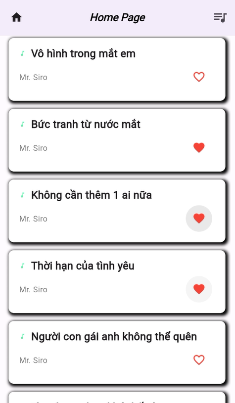
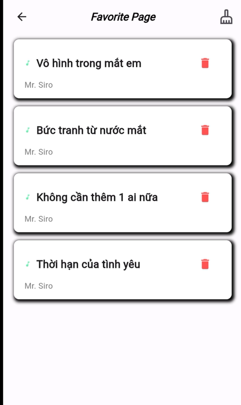

# wishlist_app
This is a demo Android app written in Flutter. 

## Features
The app has the following requirement:

Build a screen showing a list music. User can touch heart button to add this music into favorite list. In Favorite Page, user can touch delete button to remove music from list. This remove can syncthesize between 2 screen

## Requirements
To run the app, you will need:

- Visual Studio Code with latest version
- An Android emulator or Android device running Android 7.0 or later.

## Installation
To install the app, follow these steps:

1. Clone the repository to your local machine.
2. Open Visual Studio Code and select "Open an existing project".
3. Navigate to the directory where you cloned the repository and select the project directory.
4. Wait for VSCode to finish building the project.
5. Connect an Android device to your computer or launch an emulator.
6. Click the "Run" button in VsCode or Run script "Flutter run --release" in terminal to build and run the app on your device or emulator.

## Screenshot

|        Home Screen        |        Favorite Screen       |
|:-------------------------:|:------------------------:|
|  |  | 

## Video

